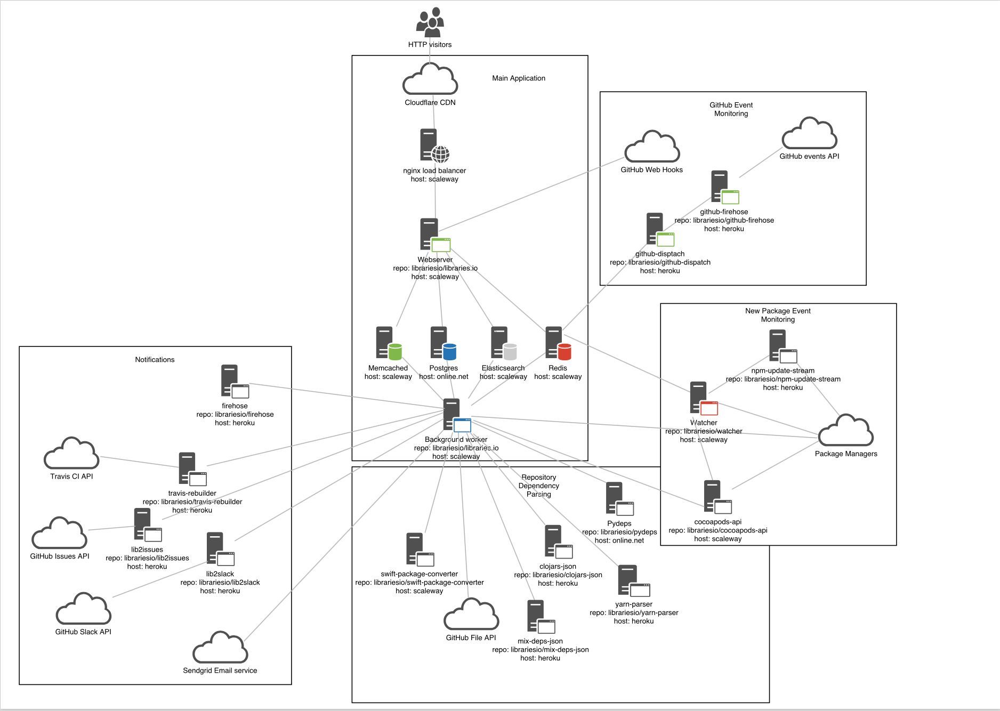

## Overview
[Data Collection](#package-managers)
* [Package Managers](#package-managers)
* [Repositories](#repositories)
* [Licenses](#licenses)

[Architecture](#architecture)
* [Diagram](#architecture)
* [Components](#components)

[SourceRank](#sourcerank)
* [Code](#code)
* [Community](#community)
* [Distribution](#distribution)
* [Documentation](#documentation)
* [Usage](#usage)

### Package Managers
Everything in Libraries.io begins with [package managers](/packagemanagers.md), on a regular basis background tasks find new or updated libraries from each of those packages managers, libraries cannot be added to the system unless they exist on one of those package managers.

#### Projects, Versions and Dependencies
Each library is stored in the [Project](https://github.com/librariesio/libraries.io/blob/master/app/models/project.rb) table, if that library's package manager supports published version numbers each new version is stored in the [Version](https://github.com/librariesio/libraries.io/blob/master/app/models/version.rb) table and if the package manager supports library dependencies then they are recorded in the [Dependency](https://github.com/librariesio/libraries.io/blob/master/app/models/dependency.rb) table.

### Repositories
Libraries.io will then augment package manager data with data from a Repository if one is referenced in the package manager. GitHub repositories will be downloaded and stored in the [Repository](https://github.com/librariesio/libraries.io/blob/master/app/models/repository.rb) table, on creation a background Sidekiq task is kicked off to download related information from GitHub including:

- [Readme](https://github.com/librariesio/libraries.io/blob/master/app/models/readme.rb)
- [Tags](https://github.com/librariesio/libraries.io/blob/master/app/models/github_tag.rb)
- [Contributors](https://github.com/librariesio/libraries.io/blob/master/app/models/github_contribution.rb)
- Owner ([GitHub user](https://github.com/librariesio/libraries.io/blob/master/app/models/github_user.rb) or [GitHub Org](https://github.com/librariesio/libraries.io/blob/master/app/models/github_organisation.rb))
- Source repository (if it's a fork)
- [Dependency Manifests](https://github.com/librariesio/libraries.io/blob/master/app/models/manifest.rb)

Some package managers that don't have a concept of published versions (like Go and Bower), often they will fall back to using tags from a source repository if available, Libraries.io attempts to use GitHub tags as a fallback for all package managers that don't provide version information.

### Licenses
License names are ran through [SPDX](https://github.com/librariesio/spdx). This standardises the many different ways of writing the same licenses into a single version, which is then used for filtering in search and listing on https://libraries.io/licenses. A library can have multiple licenses as it may other libraries with conditions that are enforced upward.If a project doesn't have any license data from the package manager then it will fall back to using the (singular) Repository license.

If a project has a non-standard or commercial license it's currently normalized to "Other" and is not indexed in search.

## Architecture
Libraries.io is made up of a number of micro-services that work together. The following diagram provides a high-level overview:

## Components

The main bits are:

### Core Web App

* [Libraries.io](https://github.com/librariesio/libraries.io) The main website and the data store.

### Parsers
* [Bibliothecary](https://github.com/librariesio/bibliothecary) parses manifest files
* [Gemnasium Parser](https://github.com/librariesio/gemnasium-parser) An improved fork of gemnasium-parser
* [mix-deps-json](https://github.com/librariesio/mix-deps-json) Elixir parser for Hex dependency manifests
* [clojars json](https://github.com/librariesio/clojars-json) Convert clojars.org data to JSON
* [Carthage Parser](https://github.com/librariesio/carthage_parser) Web service for parsing Carthage manifests
* [Yarn Parser](https://github.com/librariesio/yarn-parser) Web service for parsing yarn.lock manifests

### The API
[Firehose](https://github.com/librariesio/firehose) Server Sent Events API for Libraries.io releases

### Libraries
* [Languages](https://github.com/librariesio/languages) Just the language names and colors from github-lingust
* [Semantic Range](https://github.com/librariesio/semantic_range) node-semver written in Ruby for comparison and inclusion of semantic versions and ranges.
* [SemanticInterval](https://github.com/librariesio/semantic_interval) Turns Interval range syntax into Semantic Version range syntax
* [License Compatibility](https://github.com/librariesio/license-compatibility) Checks compatibility between different licenses from SPDX
* [SPDX](https://github.com/librariesio/spdx) Standardises licenses
* [Pictogram](https://github.com/librariesio/pictogram) Logos for programming languages and package managers
* [Package Managers](https://github.com/librariesio/package-managers) Metadata about every package manager that Libraries.io supports

### GitHub Firehose
* [Github Firehose](https://github.com/librariesio/github-firehose) Server-sent Events firehose of the GitHub public timeline
* [GitHub Dispatch](https://github.com/librariesio/github-dispatch) Sends events from the GitHub firehose into Sidekiq

### Webhooks
* [Lib2Issues](https://github.com/librariesio/lib2issues) Create GitHub Issues from Libraries.io webhooks
* [Travis Rebuilder](https://github.com/librariesio/travis-rebuilder) Rerun travis-ci tests after any dependency is updated
* [Sentinel](https://github.com/librariesio/sentinel) Automated dependency updates for Node.js projects

### Bots
* [Just Open Sourced](https://github.com/librariesio/justopensourced) Tweeting whenever a repo is open sourced on GitHub
* [First PR Bot](https://github.com/librariesio/firstprbot) Tweets whenever someone opens their first open source pull request on GitHub
* [Libby](https://github.com/librariesio/libby) Libraries.io hubot

### Firehose
* [Firehose Stream](https://github.com/librariesio/firehose-stream) Live streaming visualization of Libraries.io releases

### Tools
* [Required files (library)](https://github.com/librariesio/required_files) Ensures that certain files exist in all our repo's
* [Required files](https://github.com/librariesio/required-files) Files that should exist in every Libraries.io repository
* [libsearch](https://github.com/librariesio/libsearch) CLI for searching Libraries.io via the API
* [Picto](https://github.com/librariesio/picto) CLI for managing logos in Pictogram

### Other
* [Documentation](https://github.com/librariesio/documentation) Documentation for the whole Libraries.io project
* [Support](https://github.com/librariesio/support) Public issue tracker for Libraries.io users
* [Assets](https://github.com/librariesio/assets) Non-code assets for Libraries.io
* [GitHub Companion](https://github.com/librariesio/github_companion) Google chrome extension that adds Libraries.io to GitHub repo pages
* [D3 Dependencies](https://github.com/librariesio/d3-dependencies) D3 dependency graph visualization from Libraries.io API

### Retired repositories
* [Librarian](https://github.com/librariesio/librarian) Node.js web service for parsing dependencies from manifests
* [Librarian-parsers](https://github.com/librariesio/librarian-parsers) Node.js library for parsing dependencies from manifests
* [Librarian-cli](https://github.com/librariesio/librarian-cli) Node.js cli for parsing dependencies from manifests
* [Gem Parser](https://github.com/librariesio/gem_parser) Web service for parsing Ruby and Cocoapod manifests
* [GithubUrls](https://github.com/librariesio/github_urls) Parse GitHub repo details from a variety of urls
* [LibHub](https://github.com/librariesio/libhub) Minimalistic GitHub client for Node.js
* [Favicon](https://github.com/librariesio/favicon) Generates Libraries.io favicons for a given colour or language

## SourceRank
SourceRank is the name for the algorithm that we use to index search results. The maximum score for SourceRank is currently around 30 points.

Our analysis is broken down into:

* [Code](#code)
* [Community](#community)
* [Distribution](#distribution)
* [Documentation](#documentation)
* [Usage](#usage)

### Code

* Does the project have any outdated dependencies? Tag: `any_outdated_dependencies, Score: `-2`

### Community

* How many 'stars' does the project have? Tag: `stars` Score: `+log(stars)/2`
* How many contributors does the project have? Tag: `contributors` Score: `+log(contributors)/2`
* How many 'subscribers' does the project have? Tag: `subscribers` Score: `+log(subscribers)/2`
* Has there been an update within the last six months? Tag: `recently_pushed` Score: `+1`

### Distribution

* Is there a link to the source code? Tag: `repository_present` Score: `+1`
* Does the project use versioning? Tag: `versions_present` Score: `+1`
* Does every version use semantic versioning? Tag: `follows_semver` Score: `+1`
* Has the project reached version 1.0.0 yet? Tag: `one_point_oh` Score: `+1`
* Is the project more than six months old? Tag: `not_brand_new` Score: `+1`
* Has the project had a release within the last six months? Tag: `recent_release` Score: `+1`
* Are all published versions marked as 'pre-release' by the maintainer? Tag: `all_prereleases` Score: `-2`
* Has the project been removed from the package manager? Tag: `is_removed` Score: `-5`

### Documentation

* Does the project have a readme file? Tag: `readme_present` Score: `+1`
* Does the project have a valid license? Tag: `license_present` Score: `+1`
* Does the project have a description, homepage, repository link or keywords? Tag: `basic_info_present` Score: `+1`
* Is the project marked as deprecated by the owner? Tag: `is_deprecated' Score: `-5`
* Is the project marked as unmaintained by the maintainer? Tag: is_unmaintained Score: `-5`

### Usage

* How many [Projects](#projects-versions-and-dependencies) are dependent on this project?  Tag: `dependent_projects` Score: `+log(dependent_projects)*2`
* How many [Repositories](#repositories) are dependent on this project? Tag: `dependent_repositories` Score: `+log(dependent_repositories)`

## TODO

Expand upon:

- GitHub Firehose
- Repository monitoring
- Repository Dependencies
- Distributed package managers (Carthage)
- Notifications
- Webhooks
- Deprecated and unmaintained detection
- Removal detection
- Recommendations
- Firehose
- Rest API
- Dependency warnings
- Project suggestions
- Project mutes
- Subscriptions
